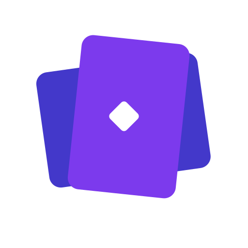

<p align="center">
  
</p>

<h1 align="center">OfficeKit</h1>

<p align="center">
  An AI-powered workspace for branded documents, slide decks, and narrated video.<br/>
  You describe the deliverable; the agent routes work and builds it. Revisions come from follow-up requests.
</p>

---

OfficeKit produces three kinds of output:

- **Documents** — one self-contained HTML file, written in a single pass and opened straight from disk
- **Presentations** — Markdown/Slidev decks, previewed live and exportable to PDF or PowerPoint when you ask
- **Video** — [HyperFrames](https://hyperframes.heygen.com/) compositions with **offline** narration via Hugging Face / [Kokoro](https://github.com/hexgrad/kokoro) and an optional **offline music bed** via Strudel/Dough (local render, no browser)

There are **two ways to install OfficeKit**. Pick one; do not mix them in the
same working directory.

| | CAPA workspace | Standalone plugin |
|---|---|---|
| Use when | You are working *in this repository* (contributing, evals, the full contract) | You want OfficeKit skills inside *another* repository |
| What you get | Skills, subagents (`research-agent`, `brand-agent`), and `WORKFLOW.md` / `AGENTS.md` via [CAPA](https://github.com/infragate/capa) | The OfficeKit skills (`setup-office-kit`, `init-brand`, `create-doc`, `create-slides`, `create-video`, plus `text-to-speech` and `strudel-offline` used by video) |
| Where work lives | `projects/` in this clone | An isolated `office-kit/` folder created in the host repo |
| Package | This git checkout | [`plugins/office-kit/`](plugins/office-kit/) ([Agent Plugins 1.0](https://agent-plugins.org/specification)) |

Plugin skills are canonical under `plugins/office-kit/skills/`. The repository
`skills/` path is a symlink to that tree, so CAPA and the plugin share one
source.

## Install

### Shared prerequisites

- [Python](https://www.python.org/) **3.10–3.12** and [uv](https://docs.astral.sh/uv/)
- [Node.js](https://nodejs.org/) **22+** and **npm**
- [FFmpeg](https://ffmpeg.org/) for final video encoding
- Network access on first run (npm, uv, and Kokoro model weights)

Kokoro weights download from Hugging Face on first synthesis and then reuse the
local cache. Some languages also need `espeak-ng`.

### Option A — CAPA (this repository)

Install [CAPA](https://github.com/infragate/capa) so `capa` is on your `PATH`,
then:

```bash
git clone https://github.com/Minitour/office-kit.git
cd office-kit
capa install
npm install
uv sync
```

`capa install` resolves skills and subagents from `capabilities.yaml` into
the agent files this checkout expects. `npm install` at the **workspace
root** hoists Node dependencies (`package.json` workspaces: `projects/*`).
`uv sync` creates the **single root** `.venv` from `pyproject.toml`. Do not
create per-project `node_modules` or virtualenvs; add a project dep with
`npm install <pkg> -w projects/<name>` from the root.

Open this repository in your agent and start chatting. Documents, decks, and
video are authored here under `projects/<slug>/`. You do **not** run
`setup-office-kit` for this path.

### Option B — standalone plugin skills

Install from the GitHub repository through your client's plugin manager—no
clone is required. Then run `setup-office-kit` in the host repository. That
creates an isolated `office-kit/` workspace and does not merge OfficeKit into
the host root. There are no CAPA subagents, MCP servers, or extra brand
identities in this package.

#### Cursor

In Cursor Agent chat:

```text
/add-plugin https://github.com/Minitour/office-kit
```

Then install **OfficeKit** from the imported marketplace. Teams can instead
import `https://github.com/Minitour/office-kit` under **Dashboard → Plugins**
and enable auto-refresh. See [Cursor plugins](https://cursor.com/docs/plugins).

#### Claude Code

In Claude Code:

```text
/plugin marketplace add Minitour/office-kit
/plugin install office-kit@office-kit
```

Skills appear under the `office-kit` namespace, for example
`/office-kit:setup-office-kit`. Reload with `/reload-plugins` after updates.

See [Claude Code plugins](https://code.claude.com/docs/en/plugins).

#### Codex

Register the GitHub repository as a marketplace:

```bash
codex plugin marketplace add Minitour/office-kit
```

Then open the Plugin Directory and install **OfficeKit**. Restart Codex or
ChatGPT desktop if the listing does not appear. See [Codex plugin
packaging](https://developers.openai.com/plugins/build/plugins).

More client detail and local development commands are in the [plugin
README](plugins/office-kit/README.md).

#### Bootstrap the host workspace

In the repository where you want documents, decks, or video (not necessarily
this clone), ask the agent to run **`setup-office-kit`**. It writes:

```text
your-repository/
└── office-kit/
    ├── brands/
    ├── projects/
    ├── scripts/
    ├── .templates/
    ├── config.toml
    ├── package.json
    └── pyproject.toml
```

After that, OfficeKit commands run from `office-kit/` (one `node_modules`, one
`.venv`). Setup is idempotent; it will not overwrite a file you changed unless
you pass `--force`.

### Developing the plugin package

From this clone, after Option A:

```bash
uv run python scripts/plugin/build.py
uv run python scripts/plugin/build.py --check
uv run python -m unittest tests.test_plugin_package
```

## How work is organized

Process is matched to the cost of the deliverable.

**A document is written directly**, in the chat context, in one pass: scaffold, author, verify, hand over. No subagent, no plan file, no approval gate, no preview server, no packaging step. Budget is three minutes. The output is `projects/<slug>/<slug>.html` — styles, brand tokens, marks, and images all inlined — plus a short `NOTES.md`.

**A deck or a video is authored in the same conversation**, so the prefix stays warm. For a deck, the preview starts from the scaffolded template so you can watch it get built. The agent should not spawn a subagent to author slides, scenes, or narration. The only production subagent is `research-agent`, and only when claims need checking.

That is a **workflow contract**, not a hard sandbox. CAPA and the host provider (Cursor, Claude Code, and others) may restrict tools, but enforcement varies.

**Four primary skills:**

| Skill | Use for | Shape |
|---|---|---|
| `create-doc` | Reports, proposals, memos, briefs, articles, letters, whitepapers | Direct, one pass |
| `create-slides` | Pitches, lectures, talks, kickoffs → Slidev | Direct, in this conversation |
| `create-video` | Explainers, motion pieces, narrated walkthroughs → HyperFrames + local TTS + Dough music bed | Direct, in this conversation |
| `init-brand` | Create or revise a visual identity under `brands/<id>/` | Routed, proposal-gated |

Supporting skills used by video: `text-to-speech` (Kokoro), plus
`music-composition` → `strudel` → `strudel-offline` for the music bed
(theory, pattern language, Dough WAV). None of those is a standalone producer.

**Two subagents:** `research-agent` (opt-in fact checking for any modality) and `brand-agent` (identity writes, behind a proposal gate). Planning, Slidev, HyperFrames, review, and export happen in the primary conversation.

**Durable state** lives on disk under `projects/<slug>/`, not only in chat:

| Modality | State |
|---|---|
| Document | `<slug>.html` (the deliverable itself) and `NOTES.md` |
| Deck, video | `plan/PLAN.md` plus `reports/build.md` and `reports/review.md` (and `research.md` / `delivery.md` when those stages run) |

**Decks and video start as soon as you ask.** The same agent writes the plan and the slides or scenes, then you say what to change. Export and final render happen only when you request a specific deliverable. Brand-only work (`init-brand`) still uses a brand-proposal gate.

## Brand contract

The workspace can hold several identities. Each one is a directory:

| Path | Role |
|---|---|
| `brands/<id>/brand.json` | Canonical, machine-readable source of truth for that identity |
| `brands/<id>/BRAND.md` | Generated usage rules |
| `brands/<id>/tokens.css` | Generated CSS custom properties (documents and decks) |
| `brands/<id>/frame.md` | Generated HyperFrames framing / safe areas |
| `brands/<id>/assets/` | Supplied logos and marks, preserved byte-for-byte |
| `config.toml` `[brand] default` | Identity used when a project does not name one |

This repo ships `brands/officekit/` as the default. Add another identity with `init-brand` rather than overwriting an existing one. Change an identity by updating that `brand.json` (via `init-brand` / `brand-agent`) and regenerating derivatives. Do not hand-edit generated files or copy colors/fonts into `config.toml` or project sources.

Two consumers hold *generated copies* rather than reading `brands/<id>/` live, and both must be refreshed after that identity changes:

- **Documents** embed the token sheet and the marks so the file stands alone. The file records which brand it used. Run `uv run python scripts/document/doc.py refresh --all`; `doc.py check` fails on a document whose brand region has drifted, so staleness cannot pass silently. The same command re-applies the template's shell CSS and script, which is how a fix to `.templates/document-html/document.html` reaches documents that already exist — `check` reports an older shell as a warning.
- **Video** projects need a project-local snapshot because HyperFrames cannot serve files above a project root. Scaffolding copies the files listed in `[video.brand_snapshot]` from `brands/<id>/` into the project's `brand/` directory.

Operational defaults (templates, canvas size, preview ports, TTS flags, export dirs) live in `config.toml`. A project's plan may override those values for that project only.

## Directory layout

```
office-kit/
├── brands/<id>/           # One identity per directory (default: officekit)
├── config.toml            # Operational defaults plus [brand] default
├── capabilities.yaml      # CAPA skills and subagents
├── plugins/office-kit/    # Portable Agent Plugin; canonical skills live here
├── skills/                # Symlink → plugins/office-kit/skills
├── WORKFLOW.md            # Orchestration contract (primary context)
├── .templates/
│   ├── document-html/     # Standalone HTML document
│   ├── presentation/      # Slidev
│   └── video/             # HyperFrames
├── scripts/
│   ├── common.py          # config, brand, Jinja render used by all scaffolders
│   ├── brand/             # catalog + brand.json → derivatives
│   ├── document/
│   │   ├── doc.py         # new | toc | check | refresh | embed
│   │   └── package.py     # asset-inlining library used by `doc.py embed`
│   ├── presentation/deck.py  # new | dev | audit | export | stop
│   └── video/video.py     # new | dev | audit | refresh | stop
├── package.json           # npm workspaces (root node_modules)
├── pyproject.toml         # Root uv / Python tooling
└── projects/<slug>/       # One deliverable per directory
    ├── <slug>.html        # a document: the whole deliverable
    ├── NOTES.md           # a document: the whole durable state
    ├── plan/PLAN.md       # a deck or video
    ├── reports/           # a deck or video
    └── …source, dist/ or renders/
```

Documents, decks, and video are scaffolded by scripts that render Jinja templates (`*.j2`, or `document.html`) and bind a brand id:

- `uv run python scripts/document/doc.py new <slug>`
- `uv run python scripts/presentation/deck.py new <slug>`  # also runs npm install -w
- `uv run python scripts/video/video.py new <slug>`

Then start the live preview with `deck.py dev <slug>` / `video.py dev <slug>`, and gate completion with `deck.py audit` / `video.py audit`. Never run `npx slidev` from the workspace root.

Add a custom template under `.templates/` and point `config.toml` at its directory name.

## Quick usage

Examples of what to say:

- “Write a two-page product brief for engineering leads as a standalone HTML doc.”
- “Build a 12-slide kickoff deck for the Q3 launch.”
- “Turn this script into a 60-second branded explainer with voiceover.”
- “Set up our brand from this logo and palette.”

For a **document**, you get the finished file back in about three minutes, then say what to change. For a **deck or video**, a plan is written and the same agent starts building in a live preview — then you ask for a named export when you want one.

If modality is unclear, you should get one routing question — not a mixed project. One directory is one engine.

## Working with the output

| Kind | Look at it | Export |
|---|---|---|
| Document | `open projects/<slug>/<slug>.html` — no server; it is already one file | Nothing to export. Print to PDF from the browser if you need paper |
| Presentation | `uv run python scripts/presentation/deck.py dev <slug>` | `uv run python scripts/presentation/deck.py export <slug>` → PDF/PPTX/PNG under `dist/`, only when requested |
| Video | `uv run python scripts/video/video.py dev <slug>` | `npx hyperframes render` from the project (via `video.py` workflow) → file under `renders/`, only when requested |

Verify a document with `uv run python scripts/document/doc.py check projects/<slug>/<slug>.html`: it proves the file is self-contained, brand-current, and accessible without opening a browser.

Verify a deck with `uv run python scripts/presentation/deck.py audit <slug>` (static; must pass before you call the deck done). Verify a video with `uv run python scripts/video/video.py audit <slug>`.

For decks and video, do not treat a live preview or a leftover `dist/` / `renders/` file as the requested delivery. Ports and default export dirs are in `config.toml`. There is one `node_modules` at the workspace root (npm workspaces); never install per-project.

## License

See [`LICENSE`](LICENSE). The optional Strudel/Dough music-bed renderer
(`plugins/office-kit/skills/strudel-offline/`, including vendored Dough and
the `@strudel/*` / `supradough` packages) is **AGPL-3.0-or-later**. The
complete text is in that skill's [`LICENSE`](plugins/office-kit/skills/strudel-offline/LICENSE).
